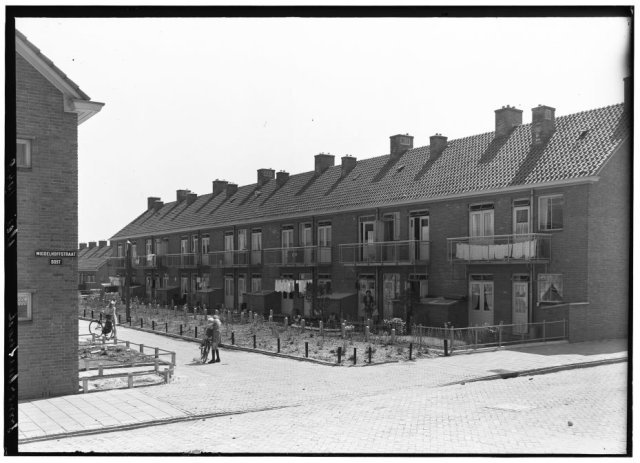

# Pioneering - pictures of brand new Amsterdam streets

This Sample Application illustrates the benefits of combining datasets. We used the [Adamlink street gazetteer](https://adamlink.nl/geo/streets/list), holding the 'startdates' of streets, and the [AdamNet set](https://data.adamlink.nl/AdamNet/all/) with all kinds of pictures from Amsterdam collections - most of them dated.

We queried for pictures that were taken within two years of the startdate of a street, to see if we could fetch images of 'Pioneering Amsterdam' - brand new streets without trees. 

